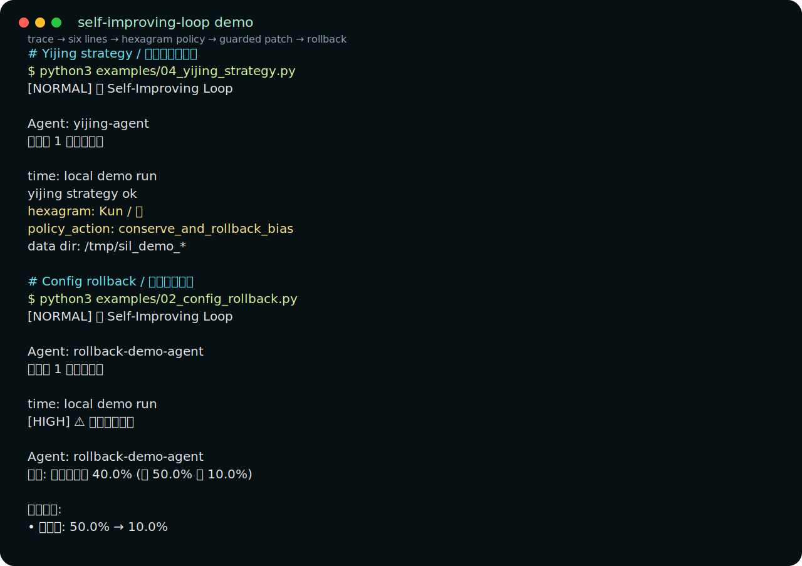

# self-improving-loop

> A hexagram-guided reliability loop for AI agents:
> **trace → six lines → hexagram policy → guarded patch → rollback on regression.**

[](https://github.com/yangfei222666-9/self-improving-loop/releases/tag/v0.1.1)
[](https://github.com/yangfei222666-9/self-improving-loop/actions/workflows/ci.yml)
[](LICENSE)
[](https://www.python.org/)
[](#performance)

Latest verified release: [v0.1.1](https://github.com/yangfei222666-9/self-improving-loop/releases/tag/v0.1.1) · Launch copy: [English + 中文](LAUNCH_COPY_BILINGUAL.md)

Most "self-improving agent" projects stop at *"log the failures, let the next run read the log"*. That's a methodology, not a loop. **This package is the loop, implemented as a compact pure-stdlib Python runtime** — no framework lock-in, no LLM dependency, no cloud.

The differentiator is the optional Yijing strategy: runtime signals are mapped
into six engineering lines, recognized as a hexagram state, converted into a
bounded policy patch, then verified through the same rollback guard as any
other strategy. It is a state machine, not fortune telling.

Overhead is negligible for normal LLM/HTTP agent calls; for sub-10ms in-memory functions, measure before wrapping.

Wrap any function, get:

- 📊 **Automatic execution tracking** (success rate, latency, rolling window)
- 🗄 **Trace storage choice**: readable JSONL by default, SQLite/WAL for multi-worker deployments
- 🧠 **Adaptive thresholds** per agent profile (high-freq / mid-freq / low-freq / critical)
- ☯️ **Optional hexagram state strategy**: six runtime dimensions → policy patch
- 🛠 **Strategy hook** for proposing improvement configs when failure patterns are detected
- 🧩 **ConfigAdapter contract** for real config backup / patch / restore
- 🛡 **Rollback trigger** when the new config regresses (>10% success drop, >20% latency gain, or 5 consecutive failures)
- 📬 **Pluggable notifier** (stub by default — swap in Telegram / Slack / whatever)

Extracted from [**TaijiOS**](https://github.com/yangfei222666-9/taiji), where the same six-line state model is used for production-scale agent workloads.



Demo artifacts: [terminal transcript](assets/demo/self_improving_loop_demo.txt) · [asciinema cast](assets/demo/self_improving_loop_demo.cast)

---

## Install

Latest verified GitHub release:

```bash
pip install https://github.com/yangfei222666-9/self-improving-loop/releases/download/v0.1.1/self_improving_loop-0.1.1-py3-none-any.whl
```

From source:

```bash
pip install git+https://github.com/yangfei222666-9/self-improving-loop.git@v0.1.1
```

Zero required dependencies. Everything is Python stdlib, including optional
SQLite trace storage via `sqlite3`.

---

## Not a...

- **...methodology doc.** Many "self-improving agent" repos are markdown templates that ask *you* to log learnings to `CLAUDE.md`. This is the runtime loop that does it for you.
- **...heavyweight framework.** Compact stdlib code. Drop it next to your existing code. No decorators forced on you. No background process.
- **...LLM-dependent.** The analysis is statistical, not LLM-based. If you want LLM-authored config tweaks, pass an `improvement_strategy` object and ask your favorite LLM inside its `analyze()` method.

---

## What is stable today

Stable:

- Execution tracking
- Adaptive failure thresholds
- JSONL trace storage with a cross-process lock
- Optional SQLite/WAL trace storage
- Strategy-triggered config patching
- ConfigAdapter-backed rollback when a patch regresses
- Optional Yijing hexagram strategy as a deterministic state router:
  runtime traces -> six engineering lines -> hexagram -> bounded policy patch

Experimental:

- Choosing the best config patch automatically. The loop calls your
  `improvement_strategy`; it does not pretend to know your agent better than
  your production tests.
- Full 64-hexagram policy coverage. The first Yijing strategy supports only
  eight core states and should be treated as a bounded policy router.

---

## 30-second example

```python
from self_improving_loop import SelfImprovingLoop

loop = SelfImprovingLoop()

def my_agent_work():
    # Your actual agent call / LLM chain / tool invocation
    return {"status": "ok", "data": ...}

result = loop.execute_with_improvement(
    agent_id="my-agent",
    task="handle user query",
    execute_fn=my_agent_work,
)

if result["improvement_triggered"]:
    print(f"Strategy applied {result['improvement_applied']} config tweaks")

if result["rollback_executed"]:
    print(f"Rolled back because: {result['rollback_executed']['reason']}")
```

That's it. The loop watches every execution and decides when to trigger tuning.
To mutate and restore real agent config, provide a strategy hook plus either a
`ConfigAdapter` or the legacy strategy `current_config/apply/rollback` methods.

---

## Run the four useful examples

From a repo checkout, start here:

```bash
python examples/01_basic_tracking.py
python examples/02_config_rollback.py
python examples/03_langgraph_adapter.py
python examples/04_yijing_strategy.py
```

They prove the four important contracts:

- `01_basic_tracking.py`: wrapper records traces and exposes stats.
- `02_config_rollback.py`: a bad patch is applied, regression is detected, and `ConfigAdapter.rollback_config()` restores the previous config.
- `03_langgraph_adapter.py`: a LangGraph-style node can be wrapped without adopting a new framework.
- `04_yijing_strategy.py`: traces become six runtime lines, a hexagram state, and a bounded policy patch.

For the verbose rollback event trail, run:

```bash
python examples/regression_rollback_demo.py
```

---

## Use it as a safety layer for your current agent

This package is not trying to replace LangGraph, CrewAI, AutoGen, OpenAI
Agents, or your own internal runner. It wraps the callable you already trust:

```python
result = loop.execute_with_improvement(
    agent_id="support-agent",
    task="answer ticket",
    execute_fn=lambda: existing_agent.run(ticket),
    context={"framework": "your-current-stack"},
)
```

`loop.track(...)` is also available as a shorter alias for the same API.

Dependency-free examples show the integration seam:

```bash
python examples/03_langgraph_adapter.py
python examples/wrap_existing_agent.py
```

The goal is narrow: traces, thresholds, guarded strategy application, and
rollback evidence around an agent you already have.

---

## Trace storage

By default, traces are written to a readable `traces.jsonl` file with a
cross-platform sidecar lock. For multi-worker deployments, switch to SQLite:

```python
from self_improving_loop import SelfImprovingLoop

loop = SelfImprovingLoop(storage="sqlite")
```

This writes `traces.sqlite3` with WAL mode enabled. The public API is unchanged:
`execute_with_improvement()` records traces, and the loop reads them back for
thresholds, metrics, and rollback checks.

---

## Optional Yijing policy strategy

The Yijing layer is implemented as a deterministic state machine, not as a
fortune-telling layer:

`runtime traces -> six engineering lines -> hexagram state -> policy patch`

The six lines are:

1. stability
2. efficiency
3. learning activity
4. routing accuracy
5. collaboration
6. governance

Use it as the strategy:

```python
from self_improving_loop import SelfImprovingLoop, YijingEvolutionStrategy

loop = SelfImprovingLoop(
    strategy=YijingEvolutionStrategy(),
    config_adapter=my_config_adapter,
)
```

`improvement_strategy=` remains supported for backward compatibility.

The engineering mapping is explicit:

| Line | Dimension | Yang means | Yin means |
|---|---|---|---|
| 1 | stability | dependencies are healthy | API/network/dependency failure |
| 2 | efficiency | high success, low latency | low success or high latency |
| 3 | learning activity | feedback / recovery signal exists | repeated failure without learning |
| 4 | routing accuracy | model/tool choice looks correct | wrong model/tool/schema drift |
| 5 | collaboration | tools / agents hand off cleanly | conflicts or context breaks |
| 6 | governance | cost and rollout are bounded | quota, cost, or policy drift |

The first version supports eight core policy states: Qian, Kun, Zhen, Kan, Bo,
Fu, Ji Ji, and Wei Ji. It returns a bounded config patch and relies on the same
canary/rollback path as any other strategy.

---

## Why this exists

Most agents have this failure mode:

1. You ship an agent.
2. It works for a week.
3. Something upstream changes (rate limits, schema drift, a new edge case).
4. Your agent starts failing.
5. You find out three days later from angry users.
6. You tweak a config, hope for the best, ship it.
7. The tweak makes another scenario worse.
8. You roll it back manually, losing the original learning.

`self-improving-loop` turns steps 3–8 into a tight feedback loop that runs inside your process, without needing observability infra, Kubernetes, or a dedicated ML team.

---

## Adaptive thresholds (no magic numbers)

Different agents have different "pulse rates". A critical alerting agent should reconsider after 1 failure; a batch classifier can tolerate 5 before triggering analysis. The library classifies agents by execution frequency and adjusts:

The automatic profile is based on `exec_count_24h`; override it with `set_manual_threshold()` when production semantics matter more than raw frequency.

| Agent profile | Failure trigger | Analysis window | Cooldown |
|---|---|---|---|
| High-frequency (>10/day) | 5 failures | 48h | 3h |
| Medium-frequency (3-10/day) | 3 failures | 24h | 6h |
| Low-frequency (<3/day) | 2 failures | 72h | 12h |
| Critical (user-marked) | 1 failure | 24h | 6h |

Or bypass the classifier and set manually:

```python
from self_improving_loop import AdaptiveThreshold

adaptive = AdaptiveThreshold()
adaptive.set_manual_threshold(
    "critical-agent",
    failure_threshold=1,
    analysis_window_hours=12,
    cooldown_hours=1,
    is_critical=True,
)
```

---

## Auto-rollback (the safety net)

When a config change ships, the loop keeps watching. It rolls back if **any** of these become true:

- Success rate drops >10%
- Average latency increases >20%
- ≥5 consecutive failures after the change

Real rollback requires a config hook. Prefer an explicit `ConfigAdapter`:

```python
from self_improving_loop import SelfImprovingLoop

class MyConfigAdapter:
    def get_config(self, agent_id):
        return load_agent_config(agent_id)

    def apply_config(self, agent_id, config_patch):
        save_agent_config(agent_id, {**load_agent_config(agent_id), **config_patch})
        return True

    def rollback_config(self, agent_id, backup_config):
        save_agent_config(agent_id, backup_config)

loop = SelfImprovingLoop(
    improvement_strategy=my_strategy,
    config_adapter=MyConfigAdapter(),
)
```

Without a config adapter or strategy rollback hook, the loop will record the
rollback decision but will not claim that your external agent config was
restored.

```python
# See recent rollbacks
rollback_history = loop.auto_rollback.get_rollback_history("my-agent")
for event in rollback_history:
    print(event["reason"], event["timestamp"])
```

---

## Pluggable notifier

The built-in `TelegramNotifier` is a stub — it logs to stdout. Override `_send_message()` to hook any channel:

```python
from self_improving_loop import TelegramNotifier

class MySlackNotifier(TelegramNotifier):
    def __init__(self, webhook_url, **kw):
        super().__init__(**kw)
        self.webhook_url = webhook_url

    def _send_message(self, message, priority="normal"):
        import requests
        requests.post(self.webhook_url, json={"text": f"[{priority}] {message}"})

loop = SelfImprovingLoop(notifier=MySlackNotifier(webhook_url="https://hooks..."))
```

---

## Performance

Measured locally with `benchmarks/overhead.py` (200 iterations per workload, Python 3.12, Windows):

| Workload profile | Absolute overhead | Relative overhead |
|---|---|---|
| ~100 ms agent call (typical LLM) | +0.27 ms | **+0.3%** |
| ~10 ms agent call (tool call) | +0.31 ms | **+3.0%** |
| sub-millisecond call | +0.08 ms | >>% (don't wrap these) |

The wrapper adds a stable **~300 μs of fixed cost per call** (trace append + threshold check). Whether that's negligible depends on your workload:

- LLM calls (>500 ms): overhead is ≤0.06% — invisible
- HTTP / DB calls (~30-100 ms): ≤1%
- Fast in-memory work (<10 ms): 3%+ — reconsider whether you need this for those

Rerun the benchmark on your own machine with `python benchmarks/overhead.py`.

Separate operation costs (triggered occasionally, not per-call):

| Operation | Cost |
|---|---|
| Failure analysis (only when threshold crossed) | ~100 ms |
| Applying improvement config | ~200 ms |
| Rollback execution | ~10 ms |

---

## Background

Extracted from [**TaijiOS**](https://github.com/yangfei222666-9/taiji) — a self-learning AI operating system with 5 *I Ching*–bound engines and a 346-heartbeat Ising physics experiment. The parent project has 14 modules; this one is the most generally reusable, so it lives as a standalone package.

TaijiOS started on **Chinese New Year 2026-02-17** and has been built through multi-AI collaboration since then.

---

## License

MIT. Ship it wherever.

## Contact / Feedback

This is a very early release. Every bug report, every "didn't work for me", every "I wish it did X" is read:

- GitHub Issue: [open one](https://github.com/yangfei222666-9/self-improving-loop/issues/new)
- Parent project: [TaijiOS](https://github.com/yangfei222666-9/taiji)

---

*"Safety first, then automation."*
